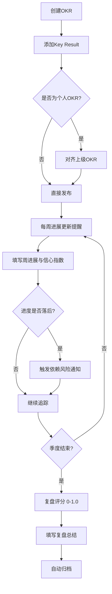

## 1. 产品概述

团队OKR目标管理系统，支持公司、部门、个人三级OKR创建与对齐，提供目标追踪、周报更新、进度热力图、季度复盘评分、历史归档及跨团队依赖管理等功能，帮助组织实现目标透明对齐与高效执行。

- 目标用户：企业中高层管理者、部门负责人、普通员工
- 核心价值：打破信息孤岛，实现目标上下对齐、横向协同，及时发现风险，提升目标达成率

## 2. 核心功能

### 2.1 用户角色

| 角色 | 注册方式 | 核心权限 |
|------|----------|----------|
| 超级管理员 | 系统预设 | 管理公司级OKR、管理组织架构、查看全局数据 |
| 部门管理者 | 管理员分配 | 管理部门级OKR、查看部门热力图、审批部门成员OKR |
| 普通员工 | 邀请注册 | 创建个人OKR、对齐上级OKR、填写周进展、查看依赖OKR |

### 2.2 功能模块

1. **仪表盘首页**：OKR总览统计、目标对齐树可视化、待办提醒、进度概览
2. **OKR管理页**：按层级浏览和管理OKR列表、创建/编辑/删除OKR
3. **OKR详情页**：Objective与Key Result详情、进度更新、对齐关系、周进展记录
4. **周报更新页**：本周进展填写、信心指数标注、历史进展查看
5. **进度热力图页**：团队OKR进度矩阵可视化、落后项快速识别
6. **复盘评分页**：季度OKR复盘、0-1.0评分、复盘总结填写
7. **历史归档页**：按季度查询历史OKR、归档数据浏览
8. **依赖管理页**：跨团队OKR依赖关系、风险提示通知、依赖状态跟踪

### 2.3 页面详情

| 页面名称 | 模块名称 | 功能描述 |
|----------|----------|----------|
| 仪表盘首页 | 统计卡片 | 显示当前季度OKR总数、平均进度、风险项数、待更新数 |
| 仪表盘首页 | 目标对齐树 | 可视化展示公司-部门-个人三级OKR对齐关系树 |
| 仪表盘首页 | 待办提醒 | 显示需要更新进展的OKR、依赖风险提醒 |
| 仪表盘首页 | 进度概览 | 各层级OKR进度分布环形图 |
| OKR管理页 | 层级切换Tab | 切换公司/部门/个人三层OKR列表 |
| OKR管理页 | OKR列表 | 显示OKR标题、负责人、进度条、状态标签 |
| OKR管理页 | 创建OKR | 弹窗表单，填写Objective、关联Key Result、选择对齐目标 |
| OKR详情页 | Objective信息 | 标题、描述、负责人、层级、对齐的上级OKR |
| OKR详情页 | Key Result列表 | 每个KR的名称、目标值、当前值、进度百分比、更新方式 |
| OKR详情页 | 对齐关系图 | 当前OKR的上下级对齐关系可视化 |
| OKR详情页 | 周进展时间线 | 按周显示的进展记录和信心指数变化曲线 |
| 周报更新页 | OKR选择 | 选择需要更新进展的OKR和KR |
| 周报更新页 | 进展填写 | 本周进展描述、信心指数（1-10）、KR当前值更新 |
| 周报更新页 | 历史记录 | 查看过往周进展记录 |
| 进度热力图页 | 团队选择 | 选择查看的部门或团队 |
| 进度热力图页 | 热力图矩阵 | 成员×OKR的进度热力矩阵，颜色深浅表示进度高低 |
| 进度热力图页 | 落后项列表 | 进度低于预期的OKR汇总列表 |
| 复盘评分页 | 季度选择 | 选择需要复盘的季度 |
| 复盘评分页 | OKR评分 | 对每个KR进行0-1.0评分，自动计算O的平均分 |
| 复盘评分页 | 复盘总结 | 填写做得好的、需改进的、下一步行动计划 |
| 历史归档页 | 季度筛选 | 按季度筛选历史OKR |
| 历史归档页 | 归档列表 | 已归档OKR的只读列表，含最终评分和复盘总结 |
| 依赖管理页 | 依赖关系图 | 可视化展示跨团队OKR依赖关系 |
| 依赖管理页 | 依赖列表 | 依赖项状态、被依赖OKR进度、风险等级 |
| 依赖管理页 | 风险通知 | 进度落后的被依赖OKR自动触发风险提示 |

## 3. 核心流程

### 3.1 OKR创建与对齐流程

用户在对应层级创建Objective，添加Key Result并设置量化目标值。个人OKR可选择对齐到部门或公司级OKR，形成目标对齐树。系统自动计算各级OKR进度。

### 3.2 周进展更新流程

系统每周自动发送进度更新提醒。用户收到提醒后，进入周报更新页，选择需要更新的KR，填写本周进展描述、信心指数，并更新KR当前值。系统自动计算进度百分比并更新上级OKR进度。

### 3.3 季度复盘流程

季度末，系统提醒进行OKR复盘。管理者对每个KR进行0-1.0评分，系统自动计算Objective平均分。参与者填写复盘总结（做得好的、需改进的、下一步行动）。复盘完成后，OKR自动归档。

### 3.4 依赖管理流程

用户在创建OKR时可声明对其他团队OKR的依赖。系统持续监控被依赖OKR的进度，当进度落后于预期时，自动向依赖方发送风险提示通知。

## 4. 用户界面设计

### 4.1 设计风格

- 主色调：深靛蓝（#1e3a5f）作为品牌色，搭配活力橙（#ff6b35）作为强调色
- 辅助色：浅灰蓝背景（#f0f4f8）、白色卡片、翠绿进度色（#10b981）、红色警告色（#ef4444）
- 按钮风格：圆角8px，主按钮填充色，次按钮描边
- 字体：标题使用 DM Sans（粗体），正文使用 Noto Sans SC
- 布局风格：左侧固定导航栏 + 右侧内容区，卡片式布局
- 图标风格：Lucide线性图标，2px描边
- 进度表示：环形进度条、线性进度条、热力图色块

### 4.2 页面设计概览

| 页面名称 | 模块名称 | UI元素 |
|----------|----------|--------|
| 仪表盘首页 | 统计卡片 | 四列卡片布局，每卡片含图标、数值、趋势箭头，浅色背景+左侧色条 |
| 仪表盘首页 | 目标对齐树 | 树形图，节点为圆角卡片，连线为曲线，层级用颜色区分 |
| 仪表盘首页 | 待办提醒 | 右侧面板，提醒项列表，带时间戳和操作按钮 |
| OKR管理页 | OKR列表 | 表格+卡片切换视图，每行含进度条、状态标签、操作按钮 |
| OKR管理页 | 创建OKR弹窗 | 模态框，分步表单，左侧预览右侧编辑 |
| OKR详情页 | KR列表 | 卡片式，每个KR独立卡片含进度环、数值、更新按钮 |
| OKR详情页 | 周进展时间线 | 垂直时间线，节点含信心指数小图标和进展摘要 |
| 进度热力图页 | 热力图矩阵 | 网格布局，单元格颜色深浅对应进度，hover显示详情tooltip |
| 复盘评分页 | 评分滑块 | 0-1.0滑块组件，实时显示分数，颜色随分数变化 |
| 依赖管理页 | 依赖关系图 | 节点连线图，风险依赖用红色虚线，安全依赖用绿色实线 |

### 4.3 响应式设计

- 桌面优先设计，最小宽度1280px
- 平板端（768-1280px）：导航栏折叠为图标模式，卡片由多列变为双列
- 移动端（<768px）：底部Tab导航，单列卡片布局，热力图横向滚动
