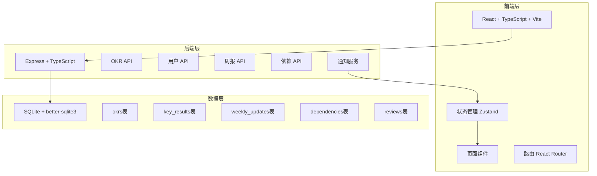
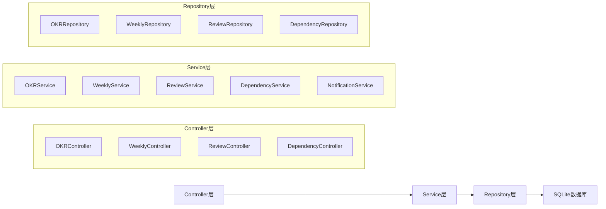
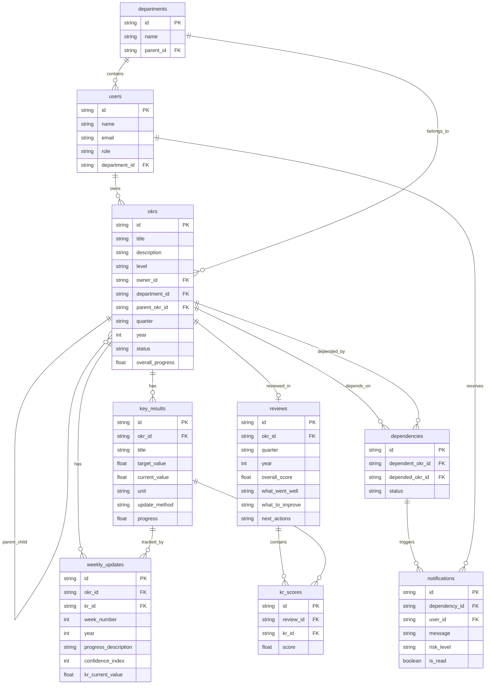

## 1. 架构设计



## 2. 技术说明

- 前端：React@18 + TailwindCSS@3 + Vite + Zustand + React Router
- 初始化工具：vite-init
- 后端：Express@4 + TypeScript
- 数据库：SQLite（better-sqlite3），Mock数据填充初始演示数据
- 图表/可视化：recharts（进度图表）、自定义SVG（对齐树、热力图、依赖关系图）
- 图标：lucide-react

## 3. 路由定义

| 路由 | 用途 |
|------|------|
| / | 仪表盘首页 - OKR总览、对齐树、待办提醒 |
| /okrs | OKR管理页 - 按层级浏览OKR列表 |
| /okrs/:id | OKR详情页 - 单个OKR详情与KR管理 |
| /weekly | 周报更新页 - 填写本周进展和信心指数 |
| /heatmap | 进度热力图页 - 团队进度矩阵可视化 |
| /review | 复盘评分页 - 季度复盘与评分 |
| /archive | 历史归档页 - 按季度查询历史OKR |
| /dependencies | 依赖管理页 - 跨团队依赖与风险通知 |

## 4. API定义

### 4.1 OKR相关API

```typescript
interface OKR {
  id: string;
  title: string;
  description: string;
  level: "company" | "department" | "individual";
  owner_id: string;
  owner_name: string;
  department_id: string | null;
  parent_okr_id: string | null;
  quarter: string;
  year: number;
  status: "draft" | "active" | "completed" | "archived";
  overall_progress: number;
  created_at: string;
  updated_at: string;
}

interface KeyResult {
  id: string;
  okr_id: string;
  title: string;
  target_value: number;
  current_value: number;
  unit: string;
  update_method: "manual" | "auto";
  data_source_url: string | null;
  progress: number;
  created_at: string;
  updated_at: string;
}

// GET /api/okrs - 获取OKR列表（支持level, quarter, status筛选）
// GET /api/okrs/:id - 获取OKR详情（含Key Results）
// POST /api/okrs - 创建OKR
// PUT /api/okrs/:id - 更新OKR
// DELETE /api/okrs/:id - 删除OKR
// GET /api/okrs/alignment-tree - 获取对齐树数据

// POST /api/okrs/:id/key-results - 添加Key Result
// PUT /api/key-results/:id - 更新Key Result
// DELETE /api/key-results/:id - 删除Key Result
// PUT /api/key-results/:id/progress - 更新KR进度值
```

### 4.2 周报相关API

```typescript
interface WeeklyUpdate {
  id: string;
  okr_id: string;
  kr_id: string;
  week_number: number;
  year: number;
  progress_description: string;
  confidence_index: number;
  kr_current_value: number;
  created_at: string;
  updated_by: string;
}

// GET /api/weekly-updates - 获取周报列表（支持okr_id, week, year筛选）
// POST /api/weekly-updates - 创建周报更新
// GET /api/weekly-updates/pending - 获取待更新的OKR列表
```

### 4.3 复盘相关API

```typescript
interface Review {
  id: string;
  okr_id: string;
  quarter: string;
  year: number;
  overall_score: number;
  what_went_well: string;
  what_to_improve: string;
  next_actions: string;
  kr_scores: { kr_id: string; score: number }[];
  reviewed_at: string;
  reviewed_by: string;
}

// POST /api/reviews - 创建复盘评分
// GET /api/reviews - 获取复盘列表（支持quarter, year筛选）
// GET /api/reviews/:okr_id - 获取单个OKR的复盘
```

### 4.4 依赖管理API

```typescript
interface Dependency {
  id: string;
  dependent_okr_id: string;
  depended_okr_id: string;
  status: "healthy" | "at_risk" | "critical";
  created_at: string;
}

interface RiskNotification {
  id: string;
  dependency_id: string;
  message: string;
  risk_level: "warning" | "critical";
  is_read: boolean;
  created_at: string;
}

// POST /api/dependencies - 创建依赖关系
// DELETE /api/dependencies/:id - 删除依赖关系
// GET /api/dependencies - 获取依赖列表（支持okr_id筛选）
// GET /api/dependencies/graph - 获取依赖关系图数据
// GET /api/notifications - 获取风险通知列表
// PUT /api/notifications/:id/read - 标记通知已读
```

### 4.5 热力图API

```typescript
interface HeatmapData {
  members: { id: string; name: string; department: string }[];
  okrs: { id: string; title: string; owner_id: string; progress: number }[];
}

// GET /api/heatmap - 获取热力图数据（支持department_id筛选）
```

### 4.6 归档API

```typescript
// GET /api/archive - 获取归档OKR列表（支持quarter, year筛选）
// POST /api/okrs/:id/archive - 手动归档OKR
```

## 5. 服务端架构图



## 6. 数据模型

### 6.1 数据模型定义



### 6.2 数据定义语言

```sql
CREATE TABLE departments (
  id TEXT PRIMARY KEY,
  name TEXT NOT NULL,
  parent_id TEXT,
  created_at TEXT DEFAULT (datetime('now'))
);

CREATE TABLE users (
  id TEXT PRIMARY KEY,
  name TEXT NOT NULL,
  email TEXT UNIQUE NOT NULL,
  role TEXT NOT NULL CHECK(role IN ('admin', 'manager', 'employee')),
  department_id TEXT,
  created_at TEXT DEFAULT (datetime('now')),
  FOREIGN KEY (department_id) REFERENCES departments(id)
);

CREATE TABLE okrs (
  id TEXT PRIMARY KEY,
  title TEXT NOT NULL,
  description TEXT,
  level TEXT NOT NULL CHECK(level IN ('company', 'department', 'individual')),
  owner_id TEXT NOT NULL,
  department_id TEXT,
  parent_okr_id TEXT,
  quarter TEXT NOT NULL,
  year INTEGER NOT NULL,
  status TEXT NOT NULL DEFAULT 'draft' CHECK(status IN ('draft', 'active', 'completed', 'archived')),
  overall_progress REAL DEFAULT 0,
  created_at TEXT DEFAULT (datetime('now')),
  updated_at TEXT DEFAULT (datetime('now')),
  FOREIGN KEY (owner_id) REFERENCES users(id),
  FOREIGN KEY (department_id) REFERENCES departments(id),
  FOREIGN KEY (parent_okr_id) REFERENCES okrs(id)
);

CREATE TABLE key_results (
  id TEXT PRIMARY KEY,
  okr_id TEXT NOT NULL,
  title TEXT NOT NULL,
  target_value REAL NOT NULL,
  current_value REAL DEFAULT 0,
  unit TEXT NOT NULL DEFAULT '%',
  update_method TEXT NOT NULL DEFAULT 'manual' CHECK(update_method IN ('manual', 'auto')),
  data_source_url TEXT,
  progress REAL DEFAULT 0,
  created_at TEXT DEFAULT (datetime('now')),
  updated_at TEXT DEFAULT (datetime('now')),
  FOREIGN KEY (okr_id) REFERENCES okrs(id) ON DELETE CASCADE
);

CREATE TABLE weekly_updates (
  id TEXT PRIMARY KEY,
  okr_id TEXT NOT NULL,
  kr_id TEXT NOT NULL,
  week_number INTEGER NOT NULL,
  year INTEGER NOT NULL,
  progress_description TEXT NOT NULL,
  confidence_index INTEGER NOT NULL CHECK(confidence_index BETWEEN 1 AND 10),
  kr_current_value REAL NOT NULL,
  updated_by TEXT NOT NULL,
  created_at TEXT DEFAULT (datetime('now')),
  FOREIGN KEY (okr_id) REFERENCES okrs(id),
  FOREIGN KEY (kr_id) REFERENCES key_results(id),
  FOREIGN KEY (updated_by) REFERENCES users(id)
);

CREATE TABLE reviews (
  id TEXT PRIMARY KEY,
  okr_id TEXT NOT NULL,
  quarter TEXT NOT NULL,
  year INTEGER NOT NULL,
  overall_score REAL CHECK(overall_score BETWEEN 0 AND 1.0),
  what_went_well TEXT,
  what_to_improve TEXT,
  next_actions TEXT,
  reviewed_by TEXT NOT NULL,
  reviewed_at TEXT DEFAULT (datetime('now')),
  FOREIGN KEY (okr_id) REFERENCES okrs(id),
  FOREIGN KEY (reviewed_by) REFERENCES users(id)
);

CREATE TABLE kr_scores (
  id TEXT PRIMARY KEY,
  review_id TEXT NOT NULL,
  kr_id TEXT NOT NULL,
  score REAL NOT NULL CHECK(score BETWEEN 0 AND 1.0),
  FOREIGN KEY (review_id) REFERENCES reviews(id) ON DELETE CASCADE,
  FOREIGN KEY (kr_id) REFERENCES key_results(id)
);

CREATE TABLE dependencies (
  id TEXT PRIMARY KEY,
  dependent_okr_id TEXT NOT NULL,
  depended_okr_id TEXT NOT NULL,
  status TEXT NOT NULL DEFAULT 'healthy' CHECK(status IN ('healthy', 'at_risk', 'critical')),
  created_at TEXT DEFAULT (datetime('now')),
  FOREIGN KEY (dependent_okr_id) REFERENCES okrs(id),
  FOREIGN KEY (depended_okr_id) REFERENCES okrs(id)
);

CREATE TABLE notifications (
  id TEXT PRIMARY KEY,
  dependency_id TEXT NOT NULL,
  user_id TEXT NOT NULL,
  message TEXT NOT NULL,
  risk_level TEXT NOT NULL CHECK(risk_level IN ('warning', 'critical')),
  is_read INTEGER DEFAULT 0,
  created_at TEXT DEFAULT (datetime('now')),
  FOREIGN KEY (dependency_id) REFERENCES dependencies(id),
  FOREIGN KEY (user_id) REFERENCES users(id)
);

CREATE INDEX idx_okrs_level ON okrs(level);
CREATE INDEX idx_okrs_quarter ON okrs(quarter, year);
CREATE INDEX idx_okrs_status ON okrs(status);
CREATE INDEX idx_okrs_parent ON okrs(parent_okr_id);
CREATE INDEX idx_okrs_owner ON okrs(owner_id);
CREATE INDEX idx_kr_okr ON key_results(okr_id);
CREATE INDEX idx_weekly_okr ON weekly_updates(okr_id);
CREATE INDEX idx_weekly_kr ON weekly_updates(kr_id);
CREATE INDEX idx_reviews_okr ON reviews(okr_id);
CREATE INDEX idx_deps_dependent ON dependencies(dependent_okr_id);
CREATE INDEX idx_deps_depended ON dependencies(depended_okr_id);
CREATE INDEX idx_notifications_user ON notifications(user_id, is_read);
```
